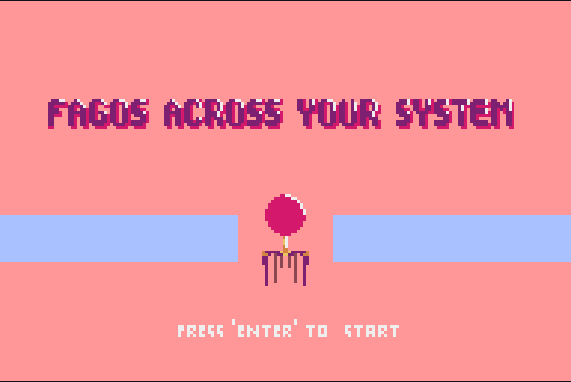

Created using [pyxel](https://github.com/kitao/pyxel) retro game engine under MIT license. 

Fagos Across Your System it’s an 8-bit shoot ‘em up game where you are a Fago in a microscopic world and the system you live it’s invaded by multiple bacteria and another weird thing. 
To survive you must shoot your DNA to these enemies to prevent the total infestation of the system, but be careful, the enemies are going to defend themselves!

This game was created for the Game Off 2021.
We hope you like it!

Credits:
- Juan Carlos Cardona (Username: JuCa) Programming and Sound
- Renata Ochoa (Username: Renosaurio) Graphics and Mapping
